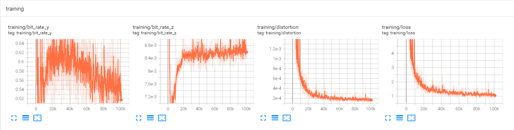
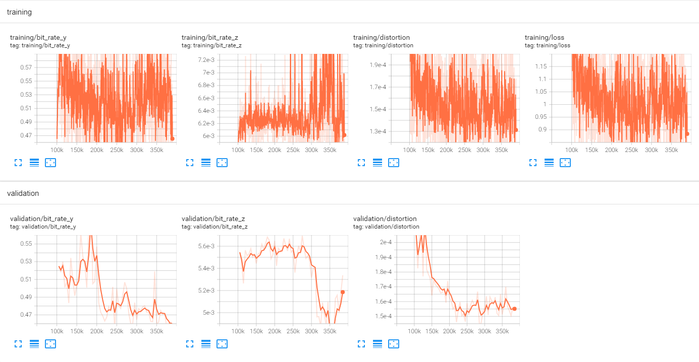
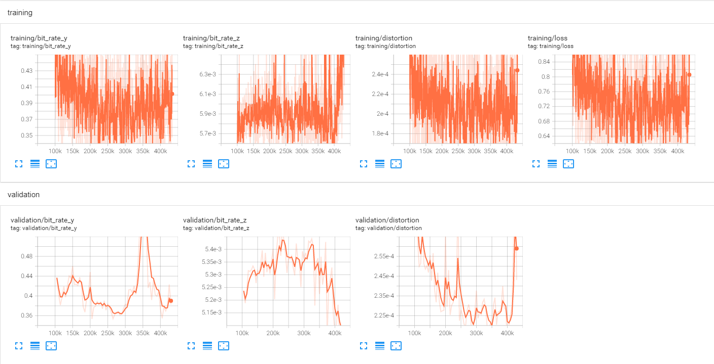
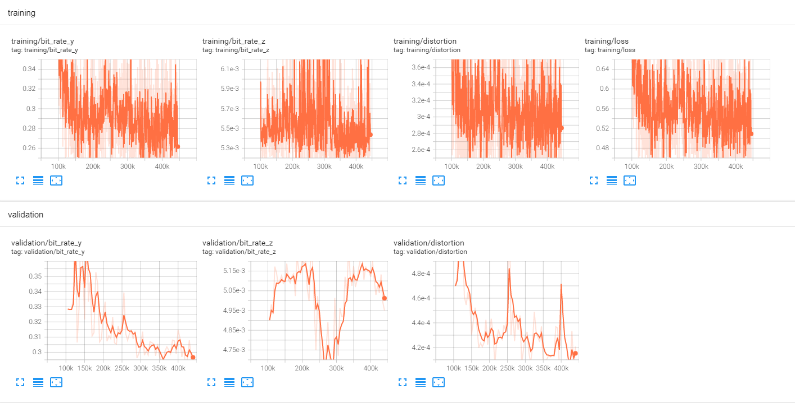
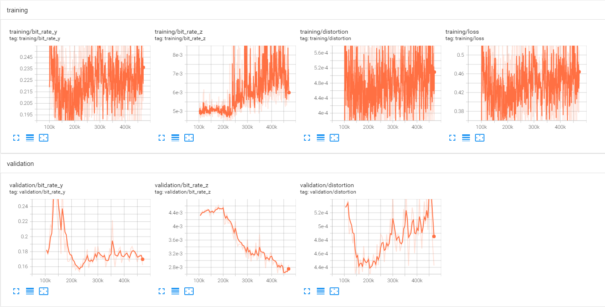
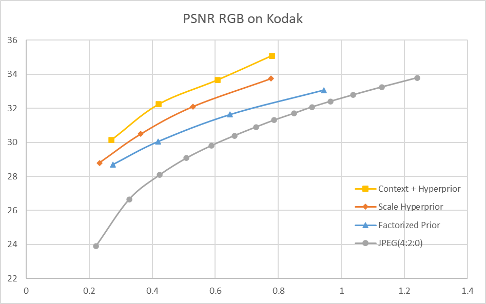
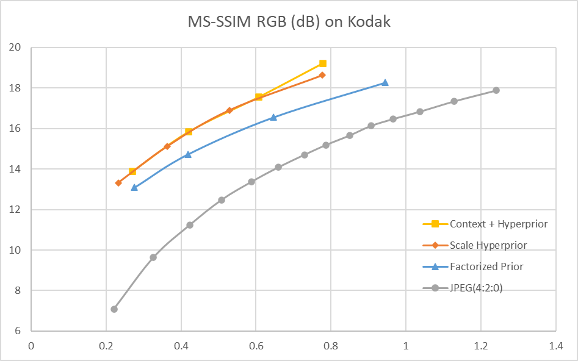
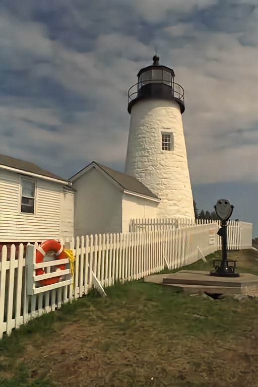
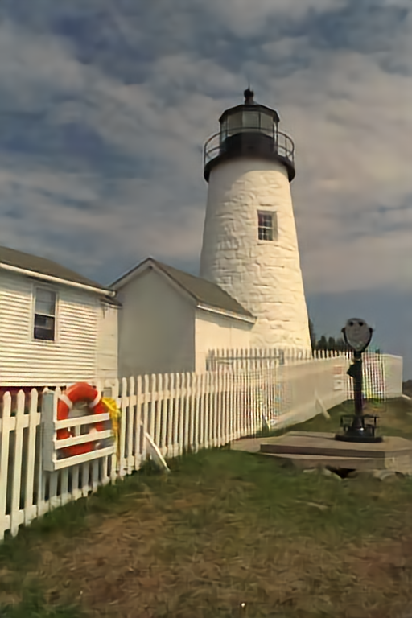

# 训练过程

## Context + Hyperprior

检查 Vimeo 训练集中的图像发现，许多目录中连续的 7 张图像均是由单张图像进行增广得到的，各图像之间差异不大，因此对于每个目录，我们仅随机选取一张作为训练样本。对于每个样本，将其随机裁剪成 256×256 输入到网络。

使用 AdamW 优化器进行模型的训练。初始 learning rate设为 2e-4，learning rate decay 设为 0.999. Batch size 设为 64

首先在 0.0483 这个码率点上进行 100 个 epoch 的预训练，随后在其基础上分别在 0.0483, 0.0250, 0.130, 0.0067 这 4 个码率点上进行训练。各模型的训练曲线如下。



预训练曲线



0.0483 码率点训练曲线



0.0250 码率点训练曲线



0.0130 码率点训练曲线



0.0067 码率点训练曲线

# 测试命令

Factorized Prior (https://github.com/USTC-iVCSeminar-Team2/end-to-end_compression)

Scale Hyperprior (https://github.com/USTC-iVCSeminar-Team2/Hyper-Prior-Byf, https://github.com/USTC-iVCSeminar-Team2/Hyper-Prior-Ly)

Context + Hyperprior (https://github.com/USTC-iVCSeminar-Team2/Context-Hyperprior-Ly) 

这 3 篇论文对应的代码和模型均可以使用如下命令进行测试。将输出 24  张 Kodak 测试图像对应的原始图与重建图的 PSNR, MS-SSIM (dB), 编码的 bpp 以及编解码耗时等信息

```bash
python test.py --test_dir <path to kodak set> --checkpoint_path <path to model file> --reco_dir <path to store reconstructed images>
```

# 测试结果（编码性能）

## RD-curve






其中，JPEG的编码是使用PIL库中的 `save` 方法进行的：

```python
img.save('kodim01.jpg', quality=75, subsampling=2)
```

`quality` 分别取 5, 10, 15, ..., 100 这 20 个点，从而得到 JPEG 的 RD 曲线

测试的端到端方案使用如下损失函数：
$$
Loss = \lambda*255^{2}*D + R
$$
其中，λ 分别取 0.0067, 0.0130, 0.0250, 0.0483，从而得到 4 个码率点及 RD 曲线

## BD-rate

| Method               | BD-rate (PSNR) | BD-rate (MS-SSIM) |
| -------------------- | -------------- | ----------------- |
| Factorized Prior     | -31.78%        | -44.73%           |
| Scale Hyperprior     | -46.98%        | -54.41%           |
| Context + Hyperprior | -56.78%        | -55.00%           |

Factorized Prior 和 Scale Hyperprior 相应的论文中均没有给出 BD-rate 的结果，比较测得的 RD-curve 和论文报道出的 RD-curve，发现在相同 bpp 下这两个模型的 PSNR 均和论文的结果有 1dB 左右的差距。Context + Hyperprior 相应的论文中报导出的 BD-rate (PSNR) 结果为 59.8%，训练的模型与其有 3% 的差距。这些性能上的差距可能是由训练集的差异以及训练策略的不同导致的。

## 主观图像质量分析



Context + Hyperprior (0.240 bpp)



Scale Hyperprior (0.210 bpp)


Factorized Prior (0.248 bpp)


JPEG (0.254 bpp)

在相近的 bpp 下，Context + Hyperprior 模型有着最佳的视觉质量。注意到 Factorized Prior 模型和 Scale Hyperprior 模型在栅栏密缝处以及灯塔的窗户位置有着较为明显的 artifacts，观察游泳圈及其周围的黄色丝带，也可比较出三者中 Context + Hyperprior 模型的重建图像质量最佳。JPEG 在这一码率点下则有着非常严重的块状效应和失真。

# 复杂度分析

## 编码器时间（s）

| lambda | Factorized Prior | Scale Hyperprior | Context + Hyperprior |
| ------ | ---------------- | ---------------- | -------------------- |
| 0.0067 | 0.33             | 0.98             | 0.25                 |
| 0.0130 | 0.41             | 1.31             | 0.38                 |
| 0.0250 | 0.52             | 1.90             | 0.29                 |
| 0.0483 | 0.64             | 2.63             | 0.34                 |

测试条件：

* Factorized Prior, Scale Hyperprior: i5 8250U + MX150 
* Context + Hyperprior: i5 xxxx + RTX3080ti

## 解码器时间（s）

| lambda | Factorized Prior | Scale Hyperprior | Context + Hyperprior |
| ------ | ---------------- | ---------------- | -------------------- |
| 0.0063 | 0.46             | 0.85             | 103.98               |
| 0.0130 | 0.53             | 1.19             | 168.63               |
| 0.0250 | 0.64             | 1.78             | 195.52               |
| 0.0483 | 0.76             | 2.51             | 252.63               |

测试条件同上。可以看到，对于 Context + Hyperprior 模型，即使使用了更强的计算资源，其解码器时间也远超于其余模型，这是由于其解码时使用了串行处理的自回归模块，从而不能进行并行计算，极大地提高了解码时间。

## 模型参数量与MACs

| Model                | Params  | MACs   |
| -------------------- | ------- | ------ |
| Factorized Prior     | 7.08e10 | 4.43e6 |
| Scale Hyperprior     | 7.40e10 | 4.97e6 |
| Context + Hyperprior | 1.62e11 | 1.21e7 |

